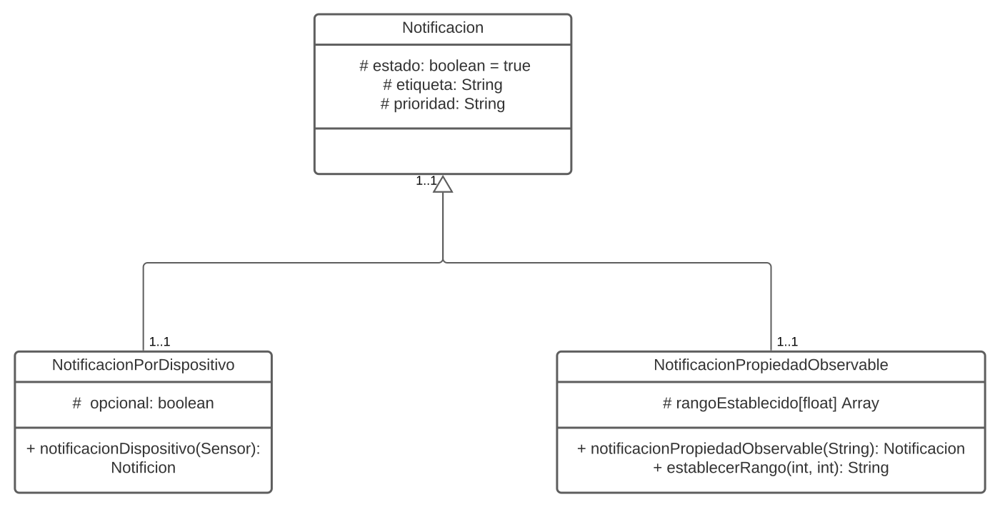

#### PROGRAMACIÓN ORIENTADA A OBJETOS

#### PROYECTO 1ER. PARCIAL 2021

Hoy en día los sistemas cyber físicos y el internet de las cosas hacen posible que tengamos acceso a una gran cantidad de información relevante a nuestro ambiente físico, información como temperatura, humedad, luz, etc. Sin embargo, esta información por sí sola no es de gran ayuda si a los datos no se les da un significado. 

En este proyecto crearemos un programa que simule el manejo de notificaciones y que haga el razonamiento de la data obtenida por sensores *(Archivo iot_telemetry_data_new.csv)*, de una de las formas más sencillas utilizando boolean logic y rule-based reasoning que es de manera general, crear condiciones para procesar la información. 

Cada sensor tiene un id de dispositivo, y cada uno de los **sensores** evalúa 7  **propiedades observables**:

- "co",

- "humidity",

- "light",

- "lpg",

- "motion",

- "smoke",

- "temp" unidad de medida grados centígrados

Un **sensor** realiza múltiples **observaciones** para cada una de las propiedades observables.

> Por ejemplo: el sensor b8:27:eb:bf:9d:51 realiza una observación en la fecha xxxxxxxx para la propiedad temperatura cuyo resultado es 22.7 grados centígrados. 

El sistema debe permitir al **usuario** enrolarse y también permitir al usuario crear **Notificaciones** que tendrán un estado activo por default. 

Las notificaciones pueden ser:

1. **Por propiedad Observable:** El usuario quiere saber sobre una propiedad observable especifica, la notificación permitirá al usuario crear rangos de valores y asignarles una etiqueta y una prioridad

> **Por ejemplo para CO** (puede ser otras etiquetas u otros valores) 
>
> | 1. PELIGRO  | valor > 70      |
> | ----------- | --------------- |
> | 2. MODERADO | 50 > valor < 69 |

**El usuario debe tener al menos configurado 1 notificación de propiedad observable para que el sistema funcione.**

2. **Por dispositivo:**  El usuario quiere enrolarse solo a X cantidad de dispositivos específicos.

> Por el ejemplo el usuario sólo desea conocer sobre el sensor b8:27:eb:bf:9d:51

Las notificaciones por dispositivo son opcionales, y funcionan en conjunto con las notificaciones de propiedad observable.

> Por ejemplo si el usuario configuró la propiedad observable **CO** y ningún dispositivo entonces vería las notificaciones de todos los dispositivos en los rangos de *PELIGRO* y *MODERADO* de **CO**.  Sin embargo, si configuró 2 dispositivos, solo vería los niveles de **CO** para los dos dispositivos configurados.

Las notificaciones pueden ser desactivadas en cualquier momento y un usuario puede tener configurada múltiples notificaciones.  

El programa debe contar con un menú principal que tenga:

1. **Registrar Usuario**

Se registra con un idUsuario

2. **Iniciar sesión**

 Luego al iniciar sesión

> 1. **Programar notificaciones: **En las notificaciones se debe validar que la propiedad observable sea válida y que los dispositivos sean válidos.
> 2. **Generar notificaciones: **Deberá solicitar un rango de fechas y generar un archivo con las notificaciones en esas fechas dadas, por propiedad observable y ordenadas por prioridad.

3. **Desactivar notificación**

**Recursos Útiles:**

https://www.arquitecturajava.com/java-stream-filter-y-predicates/

https://zetcode.com/java/readtext/

